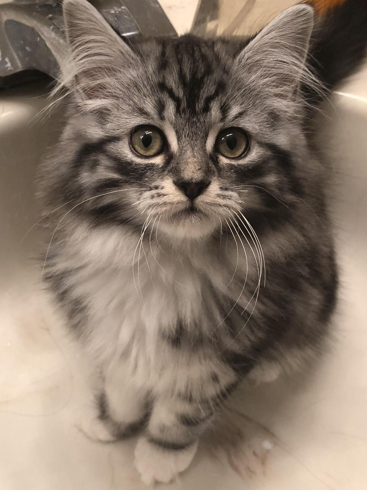

__Йохохо__, это мой первый пост в блог. Всем привет, кто читает, и добро пожаловать.

Я когда-то уже вел блог, и то было замечательное время. И вот, я снова вернулся.
Надеюсь, в этот раз я его не заброшу. Постараюсь делать регулярные записи примерно раза 2-3 в месяц.

Этот блог сделан при помощи генератора статических сайтов [gatsby](http://gatsbyjs.org/). Около трех дней ушло на чтение документации и прохождения замечательных туториалов на их сайте, еще пару вечеров на мелкие попытки начать, и один выходной день *(30 мая)* на то, чтобы по сути все сделать.

Основной тематикой блога будет моя жизнь, иногда, буду писать статьи про программирование, а также про фильмы, игры, аниме, книги, когда будут, то и свои рассказики.

Также нужно сделать в блог следующие фичи:

+ Добавить DISQUS
+ Удобный скриптик для создания шаблона статьи
+ Добавить спелчекер на прекоммит
+ Добавить смайлики
+ Мелочи по SEO и Дизайну

В целом, я пока доволен gatby, довольно простой (если знаешь React) и удобный инструмент.
До скорого.

Хотя, вот вам на последок вам миленький котик
